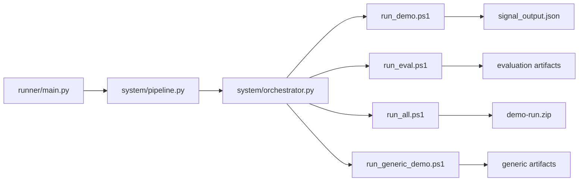

# Pipeline Flow

## Primary Execution Chain

Strategy -> Signal -> Evaluation -> Stress Test -> Audit -> Artifact -> Delivery

## Who Calls Who
1. `runner/main.py`
2. `system/pipeline.py` (builds stage list)
3. `system/orchestrator.py` (executes stages with retries + logs)
4. `open-core/scripts/run_*.ps1`
5. `open-core/src/*_cli.py`
6. `delivery/*` artifacts

## Stage Map
- `signal_demo`: generate immediate decision output
- `eval_quant`: generate reproducible quant evaluation artifacts
- `package_quant`: package quant delivery bundle (zip)
- `eval_generic`: generate non-quant generic evaluation artifacts

## Mermaid

